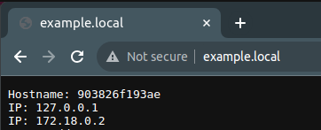
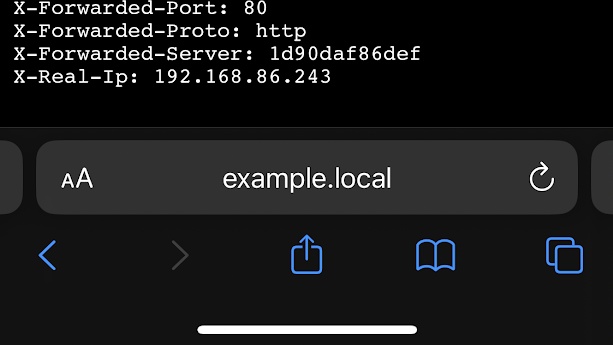

# quack_domains

## Automatically publish `.local` addresses from Docker Compose labels

This tool looks for Docker compose labels like either of these:

```yaml
labels:
  - traefik.http.routers.my_example_server.rule=Host(`example.local`)
  - quack_domains.hosts=example.local
```

And publishes the `.local` addresses on your local network, for other devices to access:




No client customization or DNS server needed!

__WARNING!__ This tool is very new and untested! You may need to dig into Node, Avahi, and/or Docker if something doesn't work ;)

## Requirements

 - A Linux server, running:
   - Avahi
   - Docker containers via Docker compose, with labels like one of those above
     - __NOTE: Rootless doesn't work currently!__ See [instructions below](#rootless-docker) for a workaround to run on the host.
 - A client that supports mDNS, which is... virtually all of them. I've tested on Ubuntu, macOS, iOS, and ChromeOS.
    - Ubuntu quirk: out of the box, it ignores mDNS subdomains - `example.local` works, but `subdomain.example.local` does not. See [instructions below](#fix-ubuntu--maybe-other-linux-clients) to fix this.

## Instructions

### Step 0: Make sure Avahi is running

This tool currently relies on the _host's_ Avahi daemon. It's sometimes installed & running out of the box, but just to make sure, run this on your host server:

```sh
sudo apt-get update && sudo apt-get install avahi-daemon && sleep 5 && sudo service dbus start && sleep 5 && sudo avahi-daemon -D
```

### Step 1: Clone repo

```sh
git clone https://github.com/ducklol2/quack_domains.git
cd quack_domains
```

### Step 2: Start quack_domains

```sh
sudo docker compose up --build -d
```

It will monitor for Docker `start`/`stop` events.

### Step 3: Modify & start _your_ containers

They'll need either Traefik labels:

```yaml
labels:
  - traefik.http.routers.my_example_server.rule=Host(`example.local`)
```

Or, if you don't use Traefik and don't want to write all that, it now supports:

```yaml
labels:
  - quack_domains.hosts=example.local || subdomain.example.local
```

If you don't have your own containers to play with, use my example! Run this:

```sh
sudo docker compose -f compose_example.yaml up -d
```

Or see `compose_example_without_traefik.yaml` for an example without Traefik.

### Step 4: Visit your domain!

Visit the label you set. If you used `compose_example.yaml` from step #2, visit http://example.local/!

### Fix Ubuntu / maybe other Linux Clients

On the default Ubuntu Desktop / Server installs, at least, mDNS is set up so that only domains like `example.local` work, but `subdomains.example.local` do not. To fix that (credit to this [AskUbuntu answer](https://askubuntu.com/a/1189644/1738003)):

```sh
sudo apt-get update && sudo apt-get install libnss-resolve
sudo bash -c "echo .local > /etc/mdns.allow"
sudo cp /etc/nsswitch.conf /etc/nsswitch.conf.backup
sudo sed -i "s/mdns4_minimal/mdns4/" /etc/nsswitch.conf
```

That worked for me, but if anything goes wrong, let me know and you can reverse those changes with:

```sh
sudo cp /etc/nsswitch.conf.backup /etc/nsswitch.conf
sudo rm /etc/mdns.allow
sudo apt-get remove libnss-resolve
```

### Rootless Docker

I tried for a long time, but I could not get this working on rootless Docker ([docs](https://docs.docker.com/engine/security/rootless/)). I think there's both DBus and networking issues that make it hard to either use the external `avahi-daemon` or run one inside the container.

So, instead, I just run the JS directly on the host, outside of Docker. You'll need to:

1.  Make sure a _recent_ version of Node is installed. Ubuntu has a really old one by default; follow [Node's official instructions to install](https://nodejs.org/en/download/package-manager).

```sh
node --version
v20.8.1
```

2.  Make sure you're in the directory, and that the tool works (_Established under name..._):

```sh
node index.js
...
Avahi stderr: Established under name 'code.local'
```

3.  You'll probably want to run it in the background on boot. If you're on Ubuntu, you can use `systemd` for that (credit to [these instructions](https://medium.com/@benmorel/creating-a-linux-service-with-systemd-611b5c8b91d6)):

```sh
cat <<EOF > quack_domains.service
[Unit]
Description=quack_domains
After=network.target
StartLimitIntervalSec=0

[Service]
Type=simple
Restart=always
RestartSec=1
User=$USER
ExecStart=node $(pwd)/index.js
Environment=DOCKER_HOST=$DOCKER_HOST

[Install]
WantedBy=multi-user.target
EOF
sudo mv quack_domains.service /etc/systemd/system/
sudo systemctl start quack_domains
sudo systemctl enable quack_domains
```

## Details

### Inspiration

I love playing with containers just on my local network, and I _really_ like how Traefik allows configuration via `compose.yaml`, so I decided to combine the two.

### Prior Art

I swear that I looked around for something like this prior to building it myself, and somehow I didn't find anything - but turns out many others have built something similar. Check them out too, see what makes sense to you! I'll note that I think mine is simpler (only Node & Avahi as dependencies).

 - https://gitlab.com/viraptor/docker_mdns: Written in Crystal, runs as a systemd service
 - https://github.com/hardillb/traefik-avahi-helper: Written in JS & Python, runs as a container, also monitors for changes

### How it works

Run as a Docker container, this executes a NodeJS script at startup that lists all Docker containers, guesses what your local IPv4 address is, looks for Traefik HTTP router rules containing ``Host(`...`)``, and runs an instance of `avahi-publish-address` for each host pointing at the local IP. Note that it talks to the _host's_ `avahi-daemon`.

### Security

There's a few potential security issues currently:
 - `network_mode: host`
 - `privileged: true`
 - Access to Docker socket
 - Access to Avahi / DBus

It might be possible to improve this tool if we can use an Avahi daemon _inside_ the container and just forward the mDNS messages through the Docker network.

Usage of the Docker socket could be protected with [Tecnativa/docker-socket-proxy](https://github.com/Tecnativa/docker-socket-proxy).

### Development

I've spent some time to get this working on GitHub Codespaces. Well, sort of - of course the actual mDNS addresses don't work on the hosted VPS! But, Avahi runs without complaint, given the right `postStartCommand` to set it up, in ``.devcontainer/devcontainer.json`, so you can mostly see whether its working.

Instead of building the container each time, I just run the script directly:

```
node index.js
```

And then, in a separate terminal, I start / stop / modify & re-up the included example and watch the logs:

```sh
sudo docker compose -f compose_example.yaml up -d
sudo docker compose -f compose_example.yaml down
```
